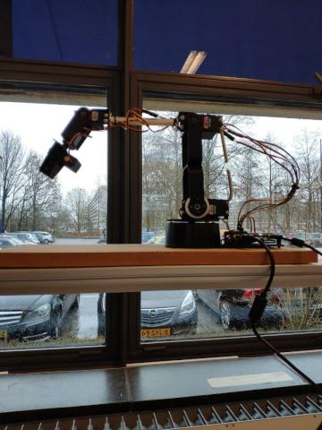

\centering

{width=50%}

\raggedright
\clearpage
\tableofcontents
\clearpage

# Robot arm controller

##inleiding

In het volgende document wordt de documentatie beschreven van de aansturings interface van de LynxMotion AL5D robot arm. Er wordt in dit document beschreven hoe het systeem in elkaar zit met behulp van een Use case diagram, Component, Behavioral state machine, Protocol state machine , Timings diagram en een Sequence diagram. In dit document zullen we ook nader toelichting geven over de bruikbaarheid van deze arm, hierbij kijken we naar de gestelde eisen in de opdracht.

\clearpage

## Use Cases

In het Use case diagram worden alle eigenschappen beschreven waarmee de gebruiker kan interacteren. In dit diagram hebben we twee systemen beschreven die elk een applicatie representeren de onderlingen contacten gaan met behulp van Ros Messages, dit kan via 3 ontvanger nodes. De eerste node is voor de emergency stop, de tweede node voor een preset position en de derde voor een custom  position.

\clearpage

## Componenten

In het Component diagram beschrijven we de verschillende componenten in het systeem, hierbij wordt onderscheid gemaakt tussen de verschillende drivers en de subsystemen daarvan. De “getCurrenPosition()” in de High level driver is gemaakt omdat de robotarm zelf geen feedback verzorgt. Deze functie maakt een schatting van de verwachte positie als de robotarm geen problemen ondervindt. Deze functionaliteit is essentieel om er achter te komen of de arm klaar is met zijn taak, hierdoor kan de Queue geïmplementeerd worden.

\clearpage

## Behavioral state machine

In het Behavioral state machine diagram hebben we een abstracte weergaven van de werkelijkheid beschreven. Bij dit gedrag hebben we onderscheid gemaakt tussen “MOVING” en “STAND_BY”. Het systeem zal terug keren naar “STAND_BY” als hij zijn positie heeft bereikt en of de Emergency stop wordt geactiveerd. Pas als het systeem in “STAND_BY” stand staat kan hij een nieuwe opdracht uitvoeren uit de Queue.

\clearpage

## Protocol state machine

In het Protocol state machine diagram hieronder wordt beschreven wat de pre en postcondities zijn van elke state verandering van de applicatie. Bij elke transitie wordt er ook beschreven wat de actie is die de transitie activeert. De beiden applicaties hebben onderling contact met de ros Action messages, de gebruikte topic zijn “pose_action”, “costum_pose_action” en "emergency”. De Robotarm controller zal naar de gepaste note een bericht sturen met de gebruikers voorkeur, dit gebeurt in “Send_message”.

\clearpage

## Timing gripper

..

\clearpage

## Init

Het sequence diagram is gemaakt ter ondersteuning voor het Timing diagram. Hierbij gaan we bij dit diagram dieper in op de verschillende functie aanroepingen en de Alt/if eisen. Daarnaast beschrijven we met behulp van notities de functionelen eisen van elke vrijheidsgraden. 

